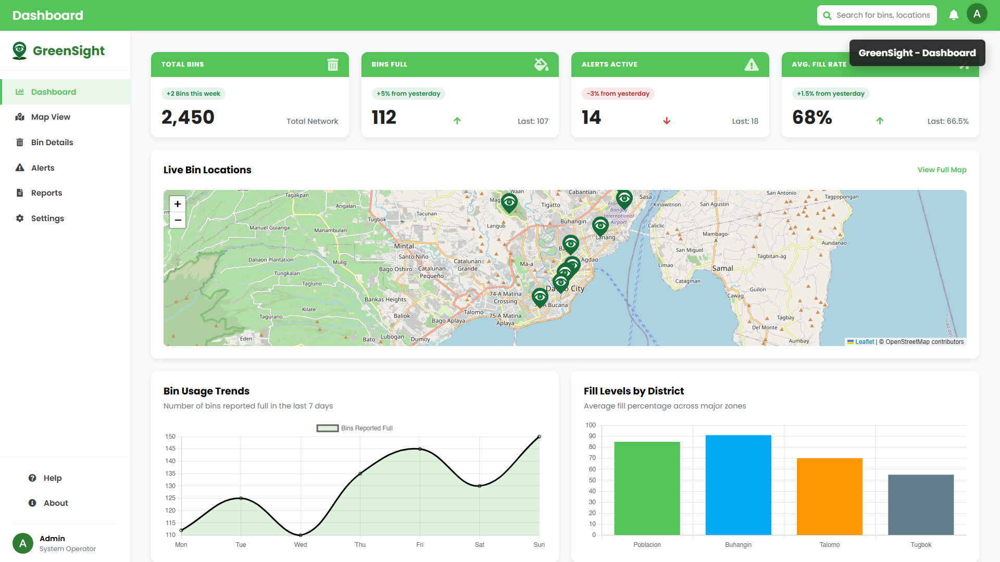
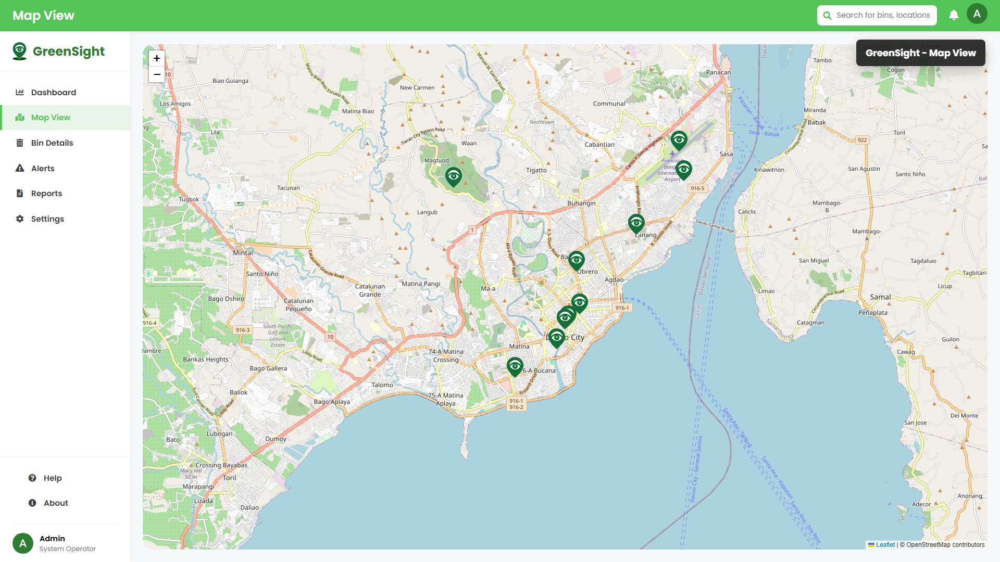
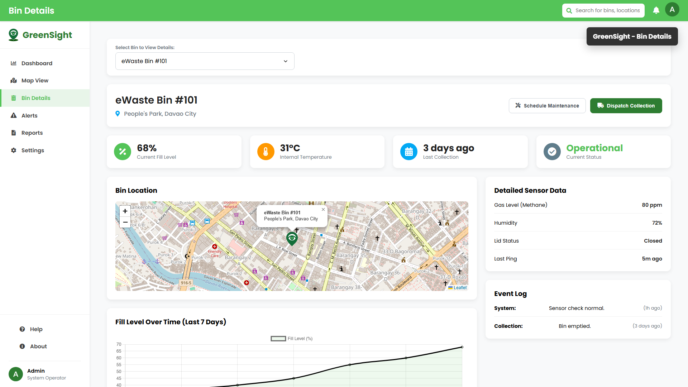
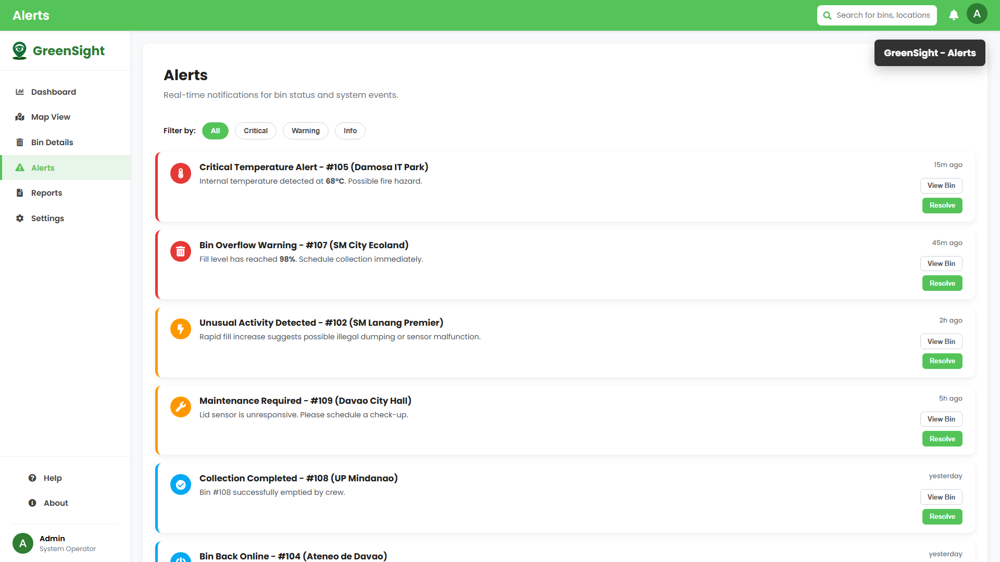
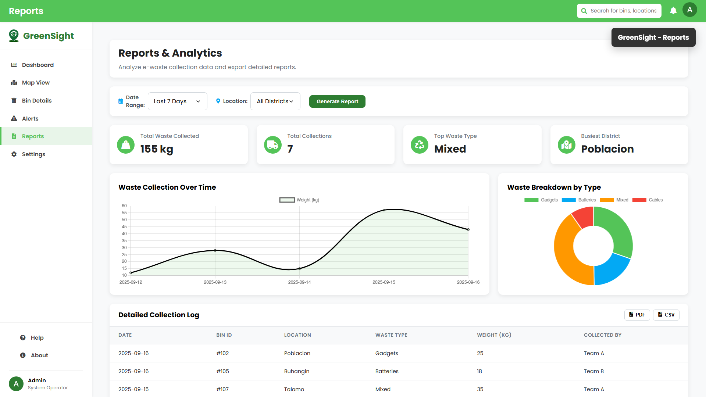
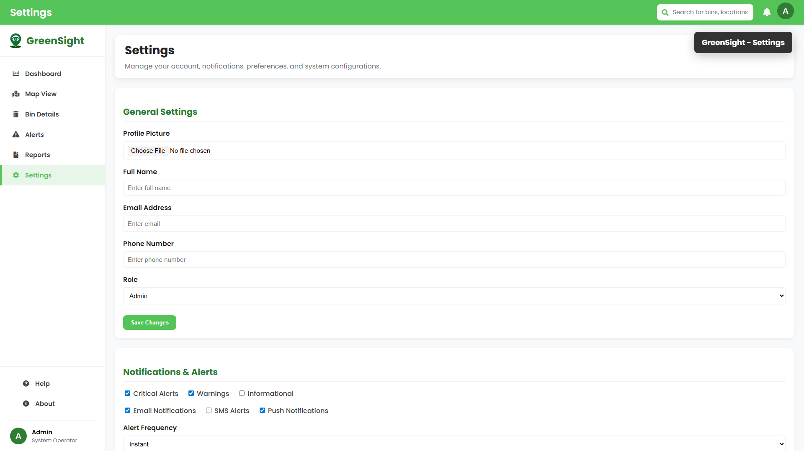
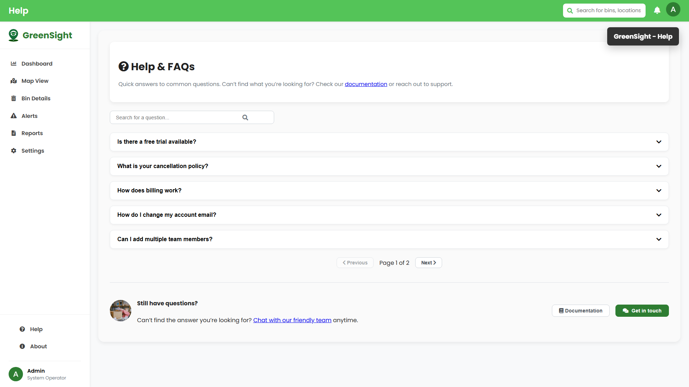
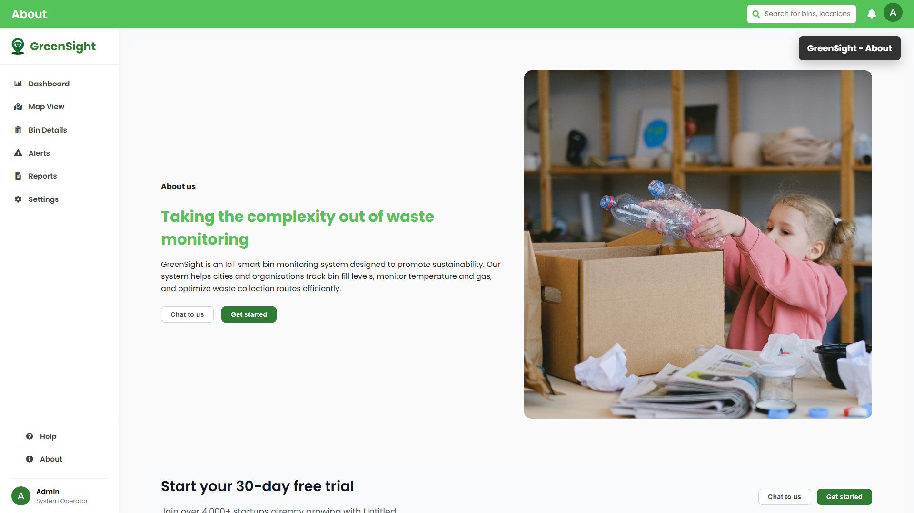

# GreenSight

Smart e-waste bin monitoring dashboard for tracking bin locations, fill levels, alerts, reports, and system settings.

## Overview

GreenSight is a web-based monitoring system for e-waste collection bins. It gives operators a central dashboard where they can view live bin locations, monitor fill levels, review alerts, inspect individual bin details, and generate collection reports.

The system was created to support cleaner and more efficient e-waste collection by helping administrators identify which bins need attention, where they are located, and what actions should be prioritized.

## Features

- Dashboard summary for total bins, full bins, active alerts, and average fill rate.
- Interactive map view showing e-waste bin locations around Davao City.
- Bin details page with fill level, temperature, collection status, sensor data, event logs, and location map.
- Alerts page with severity filters for critical, warning, and informational events.
- Reports and analytics page with collection summaries, charts, filters, and export buttons.
- Settings page for account, notification, security, reporting, integration, team, and system preferences.
- Help and FAQ page with search, accordion answers, and pagination.
- About page describing the GreenSight platform and sustainability purpose.

## System Purpose

GreenSight solves the problem of inefficient e-waste bin monitoring and delayed collection response. Without a centralized system, operators may not know which bins are nearly full, overheating, offline, or in need of maintenance.

This system helps teams make faster decisions by showing bin status, location, alerts, and collection analytics in one interface.

## Technologies Used

- HTML5
- CSS3
- JavaScript ES Modules
- Chart.js
- Leaflet.js
- OpenStreetMap tiles
- Font Awesome
- Google Fonts

## Installation

1. Clone or download the project.
2. Open the project folder:

```bash
cd Greensight
```

3. Run a local static server. One simple option is:

```bash
npx http-server . -p 4173 -c-1
```

4. Open the app in your browser:

```text
http://127.0.0.1:4173/index.html
```

## Usage

After opening the system, use the sidebar to move between pages:

- **Dashboard** - view overall bin metrics, charts, live locations, recent activity, and high-priority bins.
- **Map View** - inspect all mapped e-waste bins and their popup details.
- **Bin Details** - choose a specific bin and review its status, sensor readings, chart history, and event log.
- **Alerts** - filter alerts by severity and resolve or inspect alert items.
- **Reports** - generate analytics based on date range and district filters.
- **Settings** - manage profile, notification, security, system, report, integration, and team settings.
- **Help** - search FAQs and browse support questions.
- **About** - read about GreenSight and its sustainability goal.

## Screenshots

### Dashboard



### Map View



### Bin Details



### Alerts



### Reports



### Settings



### Help



### About



## Author

Najeeb C. Mapantas
